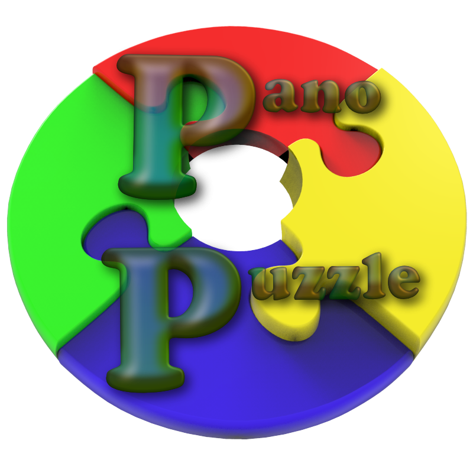
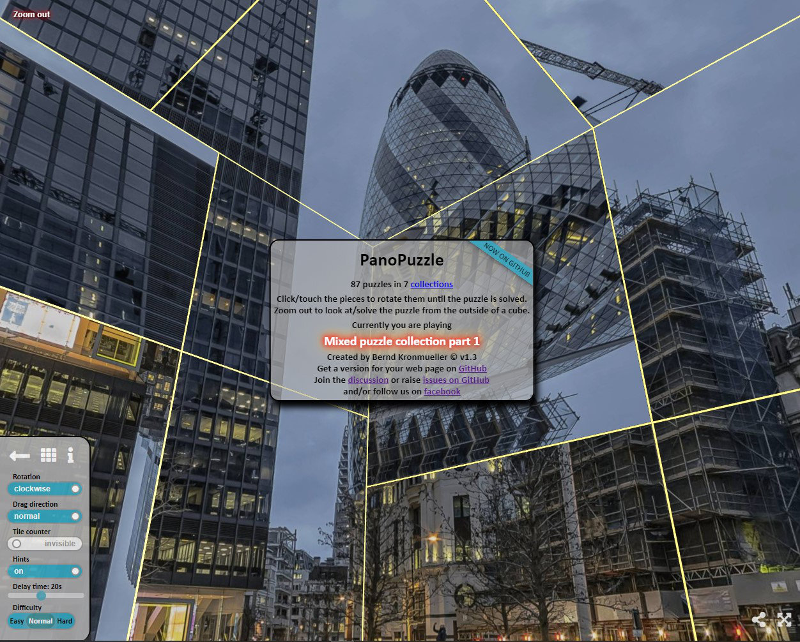
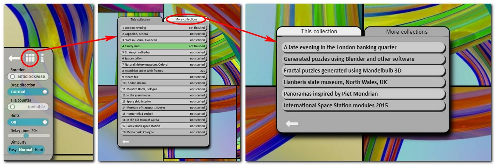
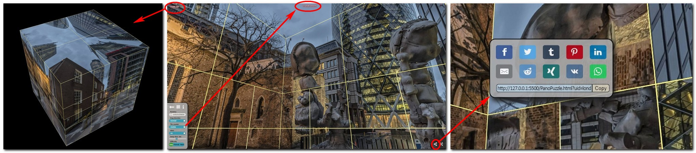

# PanoPuzzle

<br>
Panoramiczna gra logiczna 360 - twórz dłuższe interakcje ze swoimi zdjęciami 360
<br><br>
Gra dzieli sześciany panoramy 360 i obraca niektóre z nich.<br> 
Twoim zadaniem jest znaleźć i obrócić wszystkie źle obrócone i przywrócić panoramę 360 do jej pierwotnej świetności.

<br><br><br><br><br><br>
Po uruchomieniu gry będzie to wyglądać tak
<br>
Daje to wszystkie informacje potrzebne do grania w grę — po prostu rozejrzyj się, przeciągając obraz panoramiczny palcem/myszą lub poruszaj urządzeniem mobilnym i kliknij/dotknij kafelek, aby go obrócić, aż wszystkie kafelki będą wskazywać dobry kierunek.<br>
Niektóre ustawienia można zmienić, łamigłówki można wybrać bezpośrednio, a kategorie łamigłówek można zmienić, klikając / dotykając ikony ustawień w lewym dolnym rogu ekranu, co otworzy mały panel ustawień.
<br>
Gra pozwala również oddalić i rozwiązać łamigłówkę patrząc na kostkę z zewnątrz, licznik kafelków można włączyć/wyłączyć, aby ułatwić/utrudnić, a także możesz udostępnić konkretną łamigłówkę za pomocą przycisku udostępniania w prawym dolnym rogu.
<br>


## Zdobywanie PanoPuzzle na własną stronę internetową

### Pobieranie kodu

--- Nadal nad tym pracuję<br>
Zawsze możesz pobrać całość jako plik zip - należy przestrzegać struktury katalogów.
Spróbuje połączyć kilka plików zip jako wydania.

### Przygotowanie zdjęć panoramicznych
Katalog jest ścieżką względem katalogu obrazów

```bash
├───images
   ├───collection2
   │   ├───pano1
   │   │       back.jpg
   │   │       bottom.jpg
   │   │       front.jpg
   │   │       left.jpg
   │   │       right.jpg
   │   │       top.jpg
   │   │
   │   └───pano2
   │           back.jpg
   │           bottom.jpg
   │           front.jpg
   │           left.jpg
   │           right.jpg
   │           top.jpg
   │
   ├───pano1
   │       back.jpg
   │       bottom.jpg
   │       front.jpg
   │       left.jpg
   │       right.jpg
   │       top.jpg
   │
   └───pano2
           back.jpg
           bottom.jpg
           front.jpg
           left.jpg
           right.jpg
           top.jpg
```

W katalogu (np. pano1) skrypt oczekuje ścian sześcianu o nazwach back.jpg, bottom.jpg, front.jpg, left.jpg, right.jpg i top.jpg, jak widać w drzewie katalogów powyżej. Katalogi są określone w <a href="https://github.com/kronpano/PanoPuzzle/blob/main/README.md#creating-and-changing-the-configuration-file">pliku konfiguracyjnym</a>

Proszę utwórz ściany sześcianu tak, aby były zwymiarowane do potęgi 2, np. 1024x1024 lub 2048x2048
Dzięki temu skrypt nie będzie narzekał (ostrzeżenia), że tekstura nie jest potęgą 2

Do tej konwersji używam PTGui - pozwala to ustawić rozmiar i kompresję jpg - mniejsze pliki ładują się szybciej, ALE mogą pojawić się artefakty kompresji
Istnieją również bezpłatne usługi online, za pomocą których można przekonwertować obraz równoprostokątny na twarze sześcienne, takie jak<br>
https://360toolkit.co/convert-spherical-equirectangular-to-cubemap<br>
lub<br>
https://jaxry.github.io/panorama-to-cubemap/<br>
i darmowe narzędzia do pobrania (windows)<br>
https://pragmar.com/qbit/

Ta konwersja może być również zaimplementowana w javascript, ale musiałaby być uruchamiana za każdym razem, aby przekonwertować równoprostokątne dane wejściowe na obrazy cubemapy.
Zrobienie tego w javascripcie oznacza użycie urządzenia do konwersji, która wymaga czasu/mocy obliczeniowej...

Robienie tego "offline" daje również użytkownikowi możliwość wybrania kompresji jpg, która sprawia, że pliki graficzne są wystarczająco małe, ale nie pozostawiają zbyt wielu artefaktów kompresji. Zwykle używam kompresji między 50-70 - używając wyższej kompresji dla plików 2048x2048, aby je nieco zmniejszyć.

### Tworzenie i zmiana pliku konfiguracyjnego

--- Nadal nad tym pracuję<br>
Przykładowe pliki konfiguracyjne, takie jak <a href="include/PanoPuzzle_config_1.js">PanoPuzzle_config_1.js</a>, mają na początku sekcję komentarzy i opis wszystkich wzorców siatki, ale wkrótce pojawi się lepsze wyjaśnienie.

Plik konfiguracyjny jest podzielony na kilka sekcji:<br>
- nagłówek<br>
  nagłówek zawiera następujący kod i jest taki sam bez względu na to, czy masz konfigurację z jedną czy wieloma kolekcjami
  ```
  // this is the first .js file to be included in the HTML so I need to define it here
  // because a multi collection puzzle might need this value
  // this value should not be changed or PanoPuzzle might not work any more properly
  const baseURL = window.location.href.split("?")[0];

  // needed to make it possible to run several puzzle games on the same URL with different settings...
  // this name is used as a post-fix of the local storage values of a game - if two puzzle games are run
  // under the same URL with the same ConfigName - there will be a problem!!
  const ConfigName ="OneCollection"
  
  // which configuration to read for the current puzzle collection
  // if you point to the main URL e.g. panopuzzle.created-by.me without any additional parameters
  // the whichDefaultConfig variable will determine which part of PP_config will be used as the default
  // So if you add a whole new collection and want people to see it add it in PP_config and change the default value here
  const whichDefaultConfig = "demo_1";   //possible values come out of the PP_config variable 
  
  // time in ms the info stays before before hiding by itself
  const infoTime = 15000;
  
  // percentage of tiles shuffeld on easy or hard
  // to check the end blurbs after the puzzles are finished (defined in PP_config) I set the easy value to 0
  // this reports a wrong time for solving the puzzle but you don't have to play it - it will be solved
  const panoShuffleEasy = 10;
  const panoShuffleHard = 90;

  // percentage of normal shuffle rate is pecified in PP_config for each panorama individually
  ```
- PP definition (PP for PanoPuzzle)<br>
  This part is different for PanoPuzzles with one or more than one collection.
  <br><br>
  A configuration with only one collection basically defines the info variable which is shown at the start of the game or when you click the i in the settings panel. The variable contains HTML formatted text which can be styled using CSS.<br>
  Because it is a multi-line variable definition it needs to be enclosed in ` (back ticks) so you need to be careful if you want to use any back-ticks in your HTML.
  The basic format is
  ```
  PP = { 
  "InfoLinks":{
        "info":`
                multi line
                HTML variable with formatting
        `
        }
  }
  ```
  check out <a href="include/PanoPuzzle_config_1.js">PanoPuzzle_config_1.js</a> as an example
  <br><br>
  A configuration with multiple collections defines the info variable as well but in addition it will have descriptions and links to the other collections. The collections are defined furher down in PP_config but the text that will appear in the "More collections" tab and the links and tooltips are defined here.
  <br>
  The basic format is
  ```
   PP = { 
   "InfoLinks":{
        "info":`
                multi line
                HTML variable with formatting
        `,  //so far the same -- definition of info and now the additional values - don't forget the , after the `
        "links":{
                "maze":{                                        // config name - needs to be defined in PP_config
                        title:"A puzzle of a maze",             // tooltip when hovering over that collection
                        href:baseURL+"?config=maze&pano=2",     // the link to that collection + which pano to start
                        text:"Maze Puzzle plain"                // the text in the "More collections" tab
                },
                "grid":{                                         // config name - needs to be defined in PP_config
                        title:"Shows the build-in grid patterns", 
                        href:baseURL+"?config=grid",            // if no pano is given a random panorama in the first half
                                                                // of the list will be selected by the javascript 
                        text:"Grid demo - shows build-in grid patterns of PanoPuzzle"
                }, 			 
                "ColouredMazeNames":{                           // config name - needs to be defined in PP_config
                        title:"Coloured maze with names", 
                        href:baseURL+"?config=ColouredMazeNames",
                        text:"Coloured maze with names different subdirectory"
                }
        },
        // here you define which of the links above will be shown for a certain configuration
        // if you have several collections and you do not want all the other collections to show up
        // for everything you can select which ones to show - or show them all	
        "maze_Links":[                                          // this name is a config name defined in PP_config
                                                                // followed by "_Links" 
                "grid","ColouredMazeNames","ColouredMaze"       // all those names need to be defined in PP_config
        ],
        "grid_Links":[
                "maze","ColouredMazeNames","ColouredMaze"
        ],
        "ColouredMazeNames_Links":[
                "maze","grid","ColouredMaze"
        ],
        "ColouredMaze_Links":[
                "maze","grid","ColouredMazeNames"
        ]        
        }
  }
  ```
  check out <a href="include/PanoPuzzle_config_2.js">PanoPuzzle_config_2.js</a> as an example 
- PP_config<br>
  The PP_config variable contains all the information of which puzzles are in which collection and all their properties. <br>The basic format is:
  ```
  PP_config = { 
  "config-name-1" : [
		[version number, description, author, date created],        // info about config 1       
	 
		["some html text - include <class='txt'> so it can be shown in the overview of all puzzles",
        "pattern",
        "percent scrambled",
        "color of grid",
        "directory to find the cube faces",
        "unique id"
		],	
		:
		:
		["some html text - include <class='txt'> so it can be shown in the overview of all puzzles",
	 	"pattern","percent scrambled","color of grid","directory to find the cube faces","unique id"
		],
	], //<-- end bracked of first config
  "config-name-2" : [    // this is the second config 
		[version number, description, author, date created],       // info about config2
		["some html text - include <class='txt'> so it can be shown in the overview of all puzzles",
		 "pattern","percent scrambled","color of grid","directory to find the cube faces","unique id"
		],	
		:
		:
		["some html text - include <class='txt'> so it can be shown in the overview of all puzzles",
	 	"pattern","percent scrambled","color of grid","directory to find the cube faces","unique id"
		],
	]  	//<- end bracket config 2	
  } //<-- closing bracket for PP_config variable		
  ```
  - config-name<br> the name of the configuration used in PP definition to link to other collections
     - first element of this array (number 0) is used for description of this config
       - [
       - version number,<br> change that if you have changed a configuration to make sure the confiduration is re-read properly
       - description,<br> short HTML text which is used in info (defined in PP above) to replace the innerHTML of id='currentlyPlaying'   
       - author,<br> not really used
       - date<br> not really used
       - ],
    - from element 1 onwards we now have the parameters for the different puzzles
      - HTML description and end blurb <br>the HTML part with the class='txt' is extracted and used in the "This collection" selection table. The whole part is used as the end blurb when the puzzle is solved. Since it is HTML you can use all HTML elements and styles - just remember to keep it short - it should fit easily on a mobile screen.<br>
      You can have links in the blurb to link to external web sites
        ```
        ["<h3 class='txt'>Natural history museum, Oxford</h3>
        <h4>In a neo-gothic building this museum is free and has something for the whole family.</h4>
        <h5>Full virtual tour <a href='http://www.oum.ox.ac.uk/tour/tour.html' target='_blank'>here</a></h5"
        ,8,50,0xF7DC6F,"Dir5","PP1_5"
        ],
        ```
        and/or link to other collections
        ```
        ["<h3 class='txt'>London evening</h3><h4>Leadenhall quarter in the evening</h4>
          <h5>Full London night puzzle tour can be found <a href="+baseURL+"?config=LondonNight>here</a></h5",
          5,50,0xF7DC6F,"Dir1","PP1_1"
        ],	
        ```
      - wzór siatki<br>
      jest 13 wbudowanych wzorców, które są opisane w przykładowych plikach konfiguracyjnych oraz jest <a href="./PanoPuzzleGridDemo">demo siatki</a>, które pokazuje wszystkie zaimplementowane wzorce
      - procent kodowany<br>
      procent błędnie obróconych kafelków podczas odtwarzania w "normalnym" ustawieniu - dla trudnych i łatwych wartości są zdefiniowane w nagłówku pliku konfiguracyjnego.
      - kolor siatki<br>
      kolor w formacie "0xFF0000" - czasami trzeba dopasować kolor siatki, aby był faktycznie widoczny
      - katalog<br>
      ścieżka do katalogu obrazów ścian sześcianu w odniesieniu do obrazów, jak opisano w<a href="https://github.com/kronpano/PanoPuzzle/blob/main/README.md#preparing-the-panoramic-images">preparing the panoramic images</a>
      - unikalny identyfikator<br>
      unikalny identyfikator jest używany podczas udostępniania łamigłówki za pomocą przycisku udostępniania - zapewnia to, że nawet jeśli konfiguracja łamigłówki uległa zmianie, łącze nadal wskazuje właściwą łamigłówkę. Jeśli dodasz nowe łamigłówki do kolekcji, możesz chcieć dodać je na początku, aby pokazać je jako pierwsze - oznacza to, że tablica konfiguracji uległa zmianie i łamigłówka 5 jest teraz łamigłówką 6, więc odwołanie się do niej przez ?config=configA&pano=5 będzie wskazywać do złej zagadki
      PanoPuzzle tworzy wewnętrzną tabelę przeglądową, która jest używana, gdy pojawia się łącze w formacie ?uid=CMN_6.<br>
      Ten UID zostanie przetłumaczony tak, aby wskazywał właściwą łamigłówkę.<br>
      Mój sposób na tworzenie unikalnych identyfikatorów polega po prostu na wzięciu nazwy kategorii (w jakiejś skróconej formie) i dodaniu _\<numer\> od dołu do góry.

Błędy w tym pliku mogą oznaczać, że PanoPuzzle pokazuje czarne kafelki (nie można znaleźć katalogów z obrazkami, źle zdefiniowany kolor...), które będą wyświetlane tylko w konsoli narzędzi deweloperskich.<br>
<br>
Ponieważ ten plik jest tak ważny, istnieje punkt Do zrobienia napisania walidatora dla tego pliku, aby użytkownik mógł zobaczyć, czy wszystko wskazuje na właściwe miejsca....


## żywe przykłady
### - na żywo <a href="https://panopuzzle.created-by.me">PanoPuzzle</a>
Moja strona internetowa PanoPuzzle - od której to wszystko się zaczęło, można zobaczyć pod adresem https://panopuzzle.created-by.me <br>
składa się z kilku kolekcji z ponad 80 zagadkami panoramicznymi w tej chwili

### - na GitHub, aby pokazać konfigurację z tylko jedną kolekcją
https://kronpano.github.io/PanoPuzzle/PanoPuzzleOneCollection.html<br><br>
Plik konfiguracyjny ma tylko jedną kolekcję, więc nie będzie możliwości zmiany kolekcji.<br>
Korzystanie z pliku konfiguracyjnego <a href="include/PanoPuzzle_config_1.js">PanoPuzzle_config_1.js</a> w <a href="PanoPuzzleOneCollection.html">PanoPuzzleOneCollection.html</a> 

### - na GitHub, aby pokazać konfigurację z kilkoma kolekcjami
https://kronpano.github.io/PanoPuzzle/PanoPuzzleTwoCollection.html<br><br>
Plik konfiguracyjny zawiera cztery kolekcje, więc możesz wybrać, którą kolekcję chcesz odtworzyć.<br>
Korzystanie z pliku konfiguracyjnego <a href="include/PanoPuzzle_config_2.js">PanoPuzzle_config_2.js</a> w <a href="PanoPuzzleTwoCollection.html">PanoPuzzleTwoCollection.html</a>

### - na GitHub, aby pokazać wszystkie kompilacje we wzorcach podziału
https://kronpano.github.io/PanoPuzzle/PanoPuzzleGridDemo.html<br><br>
Za pomocą pliku konfiguracyjnego <a href="include/PanoPuzzle_config_grid.js">PanoPuzzle_config_grid.js</a> wywołanego przez <a href="PanoPuzzleGridDemo.html">PanoPuzzleGridDemo.html</a> tworzysz stronę internetową, która demonstruje różne wbudowany we wzory siatki.

### - na GitHub demo „jedna łamigłówka i wyjście”
https://kronpano.github.io/PanoPuzzle/OnePuzzleAndOut.html<br><br>
Użycie pliku konfiguracyjnego <a href="include/PanoPuzzle_config_OneAndOut.js">PanoPuzzle_config_OneAndOut.js</a> wywołanego przez <a href="OnePuzzleAndOut.html">OnePuzzleAndOut.html</a> tworzy pojedynczą układankę. Plik konfiguracyjny za pośrednictwem elementu Link4Next zawiera link do miejsca, w którym należy się udać po zakończeniu układanki.

## Do zrobienia
#### Walidacja pliku konfiguracyjnego
Plik konfiguracyjny to serce i dusza, które zawiera wszystkie informacje - prosta literówka może oznaczać, że wszystko działa dobrze - Z WYJĄTKIEM tej jednej zagadki, która pozostawi pusty ekran, ponieważ - nie można znaleźć katalogu, koloru/wzoru siatka nie zdefiniowana z powodu literówki, .....
Pomyślałem, że dobrym pomysłem byłoby posiadanie pewnego rodzaju „walidatora plików konfiguracyjnych”, który utworzy stronę html, która pokazuje wszystkie informacje i sygnalizuje potencjalne błędy.

#### Opcja dźwięku
Pomyślałem, że fajnie byłoby mieć opcję audio, która zacznie odtwarzać informacje lub muzykę po rozwiązaniu pewnego procentu zagadki. Powinien być opcjonalnym wpisem w pliku konfiguracyjnym.
